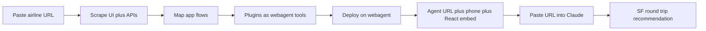

# Airline webagent demo flow

Write a detailed-but-concise two-act demo script (airline site → deployed agent → Claude books the SF trip) as DEMO.md, mapped to webagent controls without pretending scrape/phone/widget already live in the kernel.

## What you get

A single document, `DEMO.md`: a presenter-ready script that is dense, not long. Not a product build. The harness today (`src/harness.ts`, `src/mcp.ts`, `src/intake.ts`) can register tools, run many loops, and expose the same verbs over HTTP/MCP. **Frontend scrape, flow mining, public deploy, phone number, and React embed are the app on top** — the demo names them as demo beats, not as shipped kernel APIs.

Axis Bank in the traveler prompt implies an **Indian airline** (IndiGo / Air India style). The script uses a placeholder URL you can swap when you paste the real site.

## Act 1 — Company: site to public agent (~90 seconds)

1. **Paste the airline URL** on the webagent platform.
2. **Scrape the frontend** — pages, network calls, auth, cookies. Extract every exposed API (search, calendar, ancillaries, PNR, change, offers).
3. **Understand flows** (these become plugins, not slots):
   - Search / fare calendar (outbound + return)
   - Book hold
   - Change / date-change rules on return
   - Bank offers (Axis card BIN / campaign)
4. **Create plugins** = webagent `Tool`s on a `Harness` (`src/tools.ts`), fail-closed policy around pay/change (`src/policy.ts`). Bind a real model (`useModel`), not echo.
5. **Build and deploy** via intake + MCP. Public artifacts:
   - **Agent link** — `https://…/mcp` (Claude / any MCP client)
   - **Phone number** — voice channel calling the same tools
   - **React component** — `<AirlineAgent />` embed for the airline site

One line of truth: Claude, the phone, and the widget are three surfaces on **one run loop and one tool shelf**.

## Act 2 — Traveler: Claude uses the agent (~60 seconds)

Paste the **agent link** into Claude. Prompt (locked to your constraints):

> Find the best dates for a to-and-fro trip to SF. I need to leave on the 28th; return can be flexible — cheapest option. I need a date-change option on the return ticket. I have an Axis Bank credit card; check if any date gets a discount.

Claude calls the airline agent’s tools (search, calendar, change-policy, Axis offers), not a generic web search. Expected answer shape: outbound 28th, cheapest eligible return, changeability, Axis discount if any, deep link / PNR next step.

## Document shape (keep it short)

`DEMO.md` structure:

- One-paragraph pitch
- Cast (you / platform / webagent / Claude)
- Act 1 table: beat → what we show → webagent verb
- Act 2: exact prompt + tool sequence + sample recommendation
- Three artifacts callout
- What is live vs demo-layer (harness vs scrape/deploy/phone/widget)

No README rewrite; link `DEMO.md` from the README “Quick start” or a one-line “Demo” badge so the professional front door stays intact.

## Out of scope

Implementing scrape, phone, widget, or a live airline integration. That is a later product; this task is the demo narrative only.

## Todos

- Write `DEMO.md`: two-act airline script, artifacts, live vs demo-layer
- Add a one-line Demo link from README to `DEMO.md`
