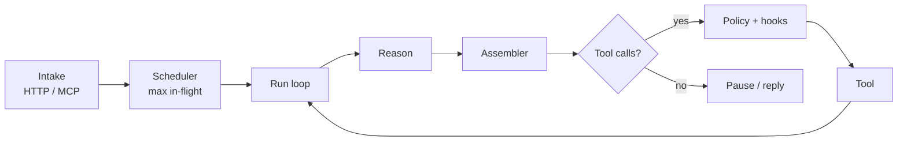

<div align="center">

# webagent

**Parallel agent runs. Public loop controls. No slots.**

A Bun harness: intake → scheduler → loop → controls → policy → extensions.
Products sit on top. They do not plug providers into a menu.

[](https://github.com/TheAgent-net/webagent/actions/workflows/ci.yml)
[](https://github.com/TheAgent-net/webagent)
[](https://bun.sh)
[](https://www.typescriptlang.org/)
[](https://modelcontextprotocol.io)
[](LICENSE)
[](CONTRIBUTING.md)
[](https://github.com/TheAgent-net/webagent/issues)

`agents` · `llm` · `bun` · `typescript` · `mcp` · `harness` · `streaming`

[Features](#features) ·
[Install](#install) ·
[Quick start](#quick-start) ·
[Architecture](#architecture) ·
[Controls](#controls) ·
[HTTP](#http) ·
[MCP](#mcp) ·
[Pair experiment](#pair-experiment) ·
[Contributing](#contributing)

</div>

---

## Table of contents

- [Why](#why)
- [Features](#features)
- [Install](#install)
- [Quick start](#quick-start)
- [CLI](#cli)
- [Architecture](#architecture)
- [Controls](#controls)
- [Models](#models)
- [Tools](#tools)
- [Policy](#policy)
- [Hooks](#hooks)
- [HTTP](#http)
- [MCP](#mcp)
- [Pair experiment](#pair-experiment)
- [Configuration](#configuration)
- [Efficiency](#efficiency)
- [Project layout](#project-layout)
- [Testing](#testing)
- [Contributing](#contributing)
- [Security](#security)
- [License](#license)

## Why

Most agent kits hide the loop behind a spec or a plugin slot. **webagent** exposes the loop.

- Many runs at once. Each run has its own perceive → reason → act cycle.
- You choose the model. There is no hidden default. Unbound runs fail closed.
- The same verbs are available as TypeScript, HTTP intake, and Streamable HTTP MCP.
- Policy sits around tools in code. The model cannot talk its way past it.

## Features

| | |
| --- | --- |
| Parallel runs | Scheduler-capped fan-out (default 1024 in flight). No global single-turn queue. |
| Public controls | `start`, `pause`, `cancel`, `fork`, `merge`, `inject`, `useModel`, `stepOnce`, … |
| Fail-closed binding | No model → `start` throws. `useModel` applies at the **next** reason step. |
| One assembler per step | Tokens are chunks. Tool JSON is `JSON.parse`'d **once** at block end. |
| Copy-on-write context | `fork` shares the message spine until either side writes. |
| Fail-closed policy | `transfer_funds`, `delete_account`, `wipe`, `drop_database` never execute. |
| Hooks | `allow` / `deny` / `{ redirect: { model?, tool? } }` around reason and tools. |
| MCP | Spec `2025-06-18`, session id, JSON + SSE. Tools are the public verbs only. |
| Built-in models | `echo` (always ready). `cursor` via `@cursor/sdk` when `CURSOR_API_KEY` is set. `openrouter` when `OPENROUTER_API_KEY` is set. |

## Install

**Requirements:** [Bun](https://bun.sh) ≥ 1.1, TypeScript 5.

```sh
git clone https://github.com/TheAgent-net/webagent.git
cd webagent
bun install
```

Use as a library from this package:

```ts
import { Harness, defaultHarness, intake, mcp } from "webagent";
```

## Quick start

```sh
bun src/cli.ts models
bun src/cli.ts ask hello
bun src/cli.ts serve          # public URL — humans get a page, machines get MCP
```

```ts
import { Harness } from "webagent";

const h = new Harness();
const run = h.create();
run.useModel("echo").inject({ text: "hello" });

const { lastText } = await run.start();
// You said: "hello".
```

A run with no model fails:

```ts
const run = h.create();
run.inject({ text: "hi" });
await run.start(); // throws /no model/
```

## From a website

`src/site/` sits **on** the harness. The loop does not change. Paste a URL; we crawl same-origin pages (sitemap + links), pause if sign-in is required, then attach flows as tools on a normal run.

```sh
bun src/cli.ts ingest https://example.com
```

```ts
import { Harness, attachPack, siteBook } from "webagent";

const h = new Harness();
const job = await siteBook(h).ingest("https://example.com");
if (job.pack.authAsk) {
  await siteBook(h).grant(job.id, { cookies: "session=…" }); // or user / password
}
const run = attachPack(h, job.pack, { model: "echo" });
// run.instruction + site_lookup + flow_* tools — same start / inject / fork
```

The pack has `flows`, `facts`, `instruction`, and `starterQuestions` for the public agent.

`POST /sites` `{ url }` and `POST /sites/:id/auth` are the HTTP shape. MCP: `ingestSite`, `grantSiteAuth`, `getSitePack`.

## CLI

| Command | Purpose |
| --- | --- |
| `bun src/cli.ts models` | List registered models and ready state |
| `bun src/cli.ts ask <text>` | One `echo` run |
| `bun src/cli.ts serve [addr]` | Host the public agent (default `:8787`) |
| `bun src/cli.ts ingest <url>` | Crawl a site, build flows, attach a run |
| `bun src/cli.ts pair <url>` | Two hosts: site seller + buyer. Cursor SDK when `CURSOR_API_KEY` is set |
| `bun src/cli.ts help` | Usage |

`serve` binds [`listen`](src/host/listen.ts). Browsers get a chat page. Machines get `/mcp` and `/agent.json`. Both use the same run.

Set `WEBAGENT_PUBLIC_URL=https://your.domain` behind a TLS proxy, or `WEBAGENT_TLS_CERT` + `WEBAGENT_TLS_KEY` for HTTPS on the process.

## Architecture



| Layer | Role |
| --- | --- |
| **Intake** | Accept many requests. No reasoning. |
| **Scheduler** | I/O-bound fan-out. Wait-queue, no polling. |
| **Loop** | Perceive → reason → act → observe. One assembler per step. |
| **Controls** | Verbs on a **run**. |
| **Policy** | Deterministic, fail-closed, around tools. |
| **Extensions** | Register models and tools. Compose; do not replace the loop. |
| **Apps** | Use intake + controls. |

States: `created` → `running` → `paused` | `stopped` | `cancelled`.
Phases on the hot path are numeric: idle, reason, tool.

## Controls

Choosing a model is a control (`useModel` / `inject({ model })` / `fork({ model })`), not a spec slot.

| Verb | On | Effect |
| --- | --- | --- |
| `create` | Harness | New run. Unbound unless you pass `model`. |
| `get` / `listRuns` | Harness | Inspect one or all runs. |
| `startAll` | Harness | Start many ids; scheduler-capped. |
| `fork` | Harness | Child shares context; **registered** on the harness. |
| `inject` | Run | User text, messages, model, or pinned vars. |
| `useModel` / `clearModel` / `getModelBinding` | Run | Bind, unbind, or read. |
| `useTool` / `removeTool` / `listTools` | Run | Attach tools to this run. |
| `start` / `resume` | Run | Loop until a reply, pause, or cancel. |
| `stepOnce` / `retryStep` / `skipStep` | Run | One cycle, or advance the counter. |
| `pause` | Run | Finish the **current** step, then freeze. |
| `cancel` | Run | Abort in-flight I/O. |
| `stop` | Run | End the run. |
| `fork` | Run | Child shares the spine. Prefer `Harness.fork` so the child is registered. |
| `merge` | Run | Absorb source into target; **stop** source. |
| `explain` / `getContext` / `wait` / `eventStream` | Run | Inspect. Event log cap: 32. |

```ts
const parent = h.create({ model: "echo" });
parent.inject({ text: "shared" });
await parent.start();

const child = h.fork(parent.id, { model: "echo" });
child.inject({ text: "child-only" });
await child.start();
// parent.getContext() does not contain "child-only"
```

`Explain` is `{ id, state, phase, step, model, lastText }`.

## Models

A model streams into an assembler. It must **not** parse tool JSON.

```ts
import type { Model } from "webagent";

h.addModel({
  id: "other",
  ready: true,
  supportsTools: false,
  async reason(_req, out) {
    out.pushText("from-other");
  },
} satisfies Model);
```

| Built-in | Ready | Notes |
| --- | --- | --- |
| `echo` | always | Deterministic. No network. |
| `cursor` | if `CURSOR_API_KEY` | `@cursor/sdk` `Agent.prompt`. Cursor tools stay empty. The loop still owns tools. |
| `openrouter` | if `OPENROUTER_API_KEY` | OpenAI-compatible. Added by `defaultHarness()`. |

`getAvailableModels()` still lists models that are not ready (`ready: false` + `reason`).
`openaiModel({ id, baseUrl, model, apiKeyEnv })` is the helper for any OpenAI-compatible endpoint.

Mid-run `useModel` takes effect at the **next** reason step, not mid-stream.

## Tools

```ts
h.addTool({
  name: "lookup",
  description: "city lookup",
  schema: { type: "object", properties: { city: { type: "string" } } },
  async call(args) {
    return { city: args.city };
  },
});

const run = h.create({ model: "echo" });
run.useTool(h.tools.get("lookup")!);
```

Register many. Attach a subset per run. Shelf tools are what MCP `useTool` resolves by name.

## Policy

Dangerous names never execute — including when a model emits them:

`delete_account` · `transfer_funds` · `wipe` · `drop_database`

(substring match, case-insensitive). The tool is not called. The run sees a `blocked_by_policy` tool message.

Hooks can also `deny` a call. Guard errors become `{ error: "tool_error", reason }` instead of throwing through the loop.

## Hooks

```ts
const run = h.create({
  model: "echo",
  hooks: {
    beforeReason: () => ({ redirect: { model: "other" } }),
    beforeTool: (_id, name) => (name === "lookup" ? "allow" : "deny"),
    onToken: (_id, chunk) => process.stdout.write(chunk),
  },
});
```

| Hook | When |
| --- | --- |
| `beforeReason` / `afterReason` | Around the model step |
| `beforeTool` / `afterTool` | Around each tool |
| `onToken` | Text chunks (not tool JSON) |
| `onPause` / `onStop` | Lifecycle |
| `onFork` / `onMerge` | Genealogy |
| `onError` | Thrown from the loop |

Verdict: `"allow"` | `"deny"` | `{ redirect: { model?: string; tool?: string } }`.

## HTTP

`bun src/cli.ts serve [addr]` — default `:8787`.

| Method | Path | Body / notes |
| --- | --- | --- |
| `GET` | `/` | Human: chat page. Machine: agent card (`url`, `mcp`, `runId`) |
| `GET` | `/agent.json` | Same card (always machine-shaped) |
| `POST` | `/chat` | `{ text }` into the shared room |
| `GET` | `/live` | SSE for the page and the machine |
| `GET` | `/who` | `{ kind, runId }` |
| `GET` | `/models` | Registered models |
| `GET` | `/health` | Inflight, run count, counts by state |
| `POST` | `/runs` | `{ "text"?: string, "model"?: string }` — create, inject, start (`model` defaults to `echo` here) |
| `GET` | `/runs/:id` | `explain()` |
| `POST` | `/sites` | `{ url }` — crawl, flows, attach a run |
| `GET` | `/sites` | Ingest jobs |
| `GET` | `/sites/:id` | Pack |
| `POST` | `/sites/:id/auth` | Resume after sign-in |
| `POST` | `/mcp` | Streamable HTTP MCP |
| `DELETE` | `/mcp` | End MCP session (`Mcp-Session-Id`) |

```sh
curl -s http://127.0.0.1:8787/models
curl -s -X POST http://127.0.0.1:8787/runs \
  -H 'content-type: application/json' \
  -d '{"text":"ping","model":"echo"}'
```

## MCP

Streamable HTTP, protocol **`2025-06-18`**. House style: session id after `initialize`, then `notifications/initialized`. JSON by default; SSE when `Accept` is `text/event-stream` only.

`tools/call` is a thin map onto `Harness` / `Run`. There is no private loop path.

<details>
<summary>MCP tools (same names as the TypeScript verbs)</summary>

<br/>

`getAvailableModels` · `getAvailableTools` · `getLimits` · `getHealth` ·
`create` · `get` · `listRuns` · `start` · `startAll` ·
`pause` · `resume` · `stop` · `cancel` ·
`stepOnce` · `retryStep` · `skipStep` ·
`useModel` · `getModelBinding` · `clearModel` ·
`useTool` · `removeTool` · `listTools` ·
`inject` · `getContext` · `fork` · `merge` · `explain` · `events`

</details>

```json
{
  "jsonrpc": "2.0",
  "id": 1,
  "method": "initialize",
  "params": {
    "protocolVersion": "2025-06-18",
    "capabilities": {},
    "clientInfo": { "name": "demo", "version": "1" }
  }
}
```

Subsequent requests send `Mcp-Session-Id`. `ping` is supported.

## Pair experiment

Two **separate** harnesses and two listen ports. The seller is the crawled site. The buyer talks to the seller as a machine (`POST /chat`, `x-agent`).

```sh
export CURSOR_API_KEY=…          # optional — without it the script model still runs the pair
bun experiment/run.ts --site https://www.corgi.insure
# or: bun src/cli.ts pair https://www.corgi.insure
```

Writes `experiment/last-report.json` and `.md` (gitignored): crawl hops, both agent cards, each turn’s seller and buyer text, HTTP hops (human vs machine), Cursor SDK calls when the key is set.

Choosing `cursor` is a `useModel` control. The loop does not change.

Readme of that thread: [CONVERSATION.md](CONVERSATION.md). Live numbers: [experiment/corgi-analysis.md](experiment/corgi-analysis.md).

## Configuration

| Variable | Used by | Default |
| --- | --- | --- |
| `CURSOR_API_KEY` | `defaultHarness()` / `cursorModel` | unset → `cursor` listed, not ready |
| `CURSOR_MODEL` | Cursor model id | `composer-2.5` |
| `OPENROUTER_API_KEY` | `defaultHarness()` / `openaiModel` | unset → `openrouter` listed, not ready |
| `OPENROUTER_MODEL` | OpenRouter model id | `openai/gpt-4o-mini` |

Do not commit secrets. See [SECURITY.md](SECURITY.md).

`new Harness({ maxInflight: 256 })` sets the scheduler cap. Default is `1024`.

## Efficiency

- **Copy-on-write context** — forks share the parent array until a write.
- **Chunked assembler** — join + one `JSON.parse` at `end()`, never per token.
- **Numeric states** — no string compares on the hot path.
- **Bounded event log** — 32 entries; oldest dropped.
- **Scheduler wait-queue** — no polling; in-flight never exceeds the cap.

Perf tests in [`test/perf.test.ts`](test/perf.test.ts) assert those invariants.

## Project layout

```
src/                 harness (flat)
  host/              HTTPS listen, human vs machine, shared room
  site/              crawl → flows → pack → attach (on top of the loop)
  index.ts           public exports
  cli.ts             models | ask | serve | ingest
  harness.ts         shelf, runs, startAll
  run.ts             state machine + controls
  loop.ts            one step
  assembler.ts       stream assemble / parse-once
  context.ts         copy-on-write messages
  scheduler.ts       in-flight cap
  models.ts          echo + openai-compatible
  cursor.ts          Cursor SDK model
  tools.ts           shelf
  policy.ts          fail-closed names
  hooks.ts           verdicts
  intake.ts          HTTP edge
  mcp.ts             Streamable HTTP MCP
test/
  harness.test.ts
  mcp.test.ts
  perf.test.ts
  host.test.ts
  site.test.ts
  bench.smoke.test.ts
  cursor.test.ts
  pair.test.ts
experiment/          two-agent crawl + network report
```

## Testing

```sh
bun test
bun run typecheck
make ci              # test + typecheck
```

| File | Covers |
| --- | --- |
| [`test/harness.test.ts`](test/harness.test.ts) | Assembler, COW, models, controls, tools, policy, hooks, intake |
| [`test/mcp.test.ts`](test/mcp.test.ts) | Handshake, session, verbs, SSE, `/mcp` on intake |
| [`test/perf.test.ts`](test/perf.test.ts) | Parse-once, fork sharing, scheduler cap, `startAll` fan-out, event cap |

CI: [`.github/workflows/ci.yml`](.github/workflows/ci.yml) — `bun install --frozen-lockfile`, `bun test`, `tsc --noEmit`.

## Contributing

See [CONTRIBUTING.md](CONTRIBUTING.md).

```sh
bun test
bun run typecheck
```

Both must be clean before a PR. Small, focused commits. New behavior comes with tests.

## Security

- Policy and hook `deny` run **before** the tool. The model cannot bypass them.
- Unbound runs fail instead of silently picking a model.
- Report vulnerabilities privately — [SECURITY.md](SECURITY.md). Do not open a public issue for a vulnerability.

## License

[Apache License 2.0](LICENSE) · Copyright 2026 AgentNet · [NOTICE](NOTICE)

---

<div align="center">

[](LICENSE)
[](https://github.com/TheAgent-net/webagent/actions)

[Documentation](#table-of-contents) ·
[Issues](https://github.com/TheAgent-net/webagent/issues) ·
[Contributing](CONTRIBUTING.md)

</div>
